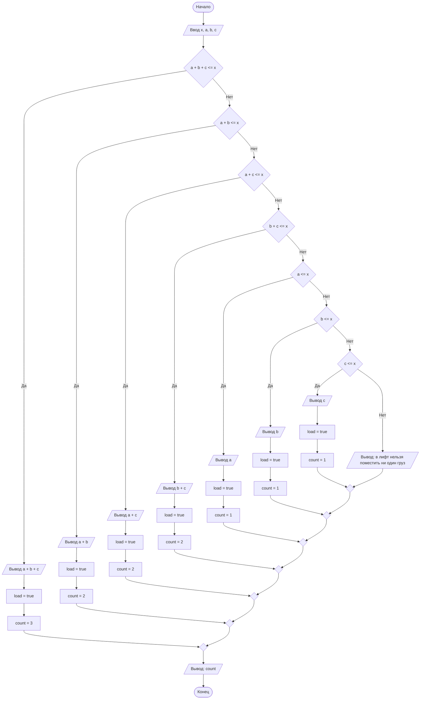

## Отчет по лабораторной работе № 1

#### № группы: `ПМ-2402`

#### Выполнил: `Павлов Максим Витальевич`

#### Вариант: `18`

### Cодержание:

- [Постановка задачи](#1-постановка-задачи)
- [Входные и выходные данные](#2-входные-и-выходные-данные)
- [Выбор структуры данных](#3-выбор-структуры-данных)
- [Алгоритм](#4-алгоритм)
- [Программа](#5-программа)
- [Анализ правильности решения](#6-анализ-правильности-решения)

### 1. Постановка задачи

- Условие задачи

> В лифт с грузоподъёмностью X пытаются загрузить грузы весом A, B, C. Проверить, какие из грузов могут быть помещены в лифт без превышения допустимой массы, и определить, сколько грузов можно поместить в лифт. На вход программы подаются натуральные числа X, A, B, C.

В ходе решения задачи нужно определить, какие именно из трех грузов могут быть помещены в лифт, при этом не превысив допустимую грузоподъемность. Нужно учитывать, что может быть несколько комбинаций из таких грузов и в выводе программы должны быть все они. Следует рассмотреть случаи, когда в лифт может быть помещен только один груз (например, если X = 10, A = 8, B = 3, C = 14), два груза (X = 50, A = 25, B = 15, C = 37) и все три груза (X = 15, A = 5, B = 3, C = 7).

### 2. Входные и выходные данные

#### Входные данные 

На вход подается натуральных 4 числа, означающие грузоподъемность лифта и вес каждого из трех грузов. Переменная с типом данных `int` может принимать значения до 2<sup>31</sup> включительно. 

| Данные      | Тип                | Max значение   |
|-------------|--------------------|----------------|
| X (Число 1) | Натуральное число  | 2<sup>31</sup> |
| A (Число 2) | Натуральное число  | 2<sup>31</sup> |
| B (Число 2) | Натуральное число  | 2<sup>31</sup> |
| C (Число 2) | Натуральное число  | 2<sup>31</sup> |

#### Данные на выход

На выходе программа должна вывести, какие именно грузы могут быть помещены в лифт, их вес, а также количество таких грузов в лифте.

| Данные              | Тип                |
|---------------------|--------------------|
| Наименования грузов | Строка             |
| Вес грузов          | Натуральное число  |
| Количество грузов   | Целое число        |

### 3. Выбор структуры данных
На вход программа получает четыре вещественных числа, для хранения которых создаются переменные `X`, `A`, `B`, `C` с типом данных `int`. Также в ходе работы программы будут использованы флаг для отслеживания загруженных в лифт грузов с переменной `load` и типом данных `boolean` и счетчик для подсчета количества грузов в лифте с переменной `count` и типом данных `int`. 

### 4. Алгоритм

1. **Ввод данных**
   
   Программа принимает на вход четыре вещественных числа числа (`X`, `A`, `B`, `C`).

2. **Сравнение чисел и вывод данных**
   
   Программа сравнивает значения суммы чисел `A`, `B`, `C` и число `X`, если сумма оказывается меньше или равна числу `X` - программа выводит наименования грузов и сумму чисел `A`, `B`, `C`, а также количество грузов. Если сумма больше - программа переходит к следующему шагу и начинает сравнивать суммы комбинаций из двух чисел (`A` и `B`, `A` и `C`, `B` и `C`) с числом `X`. Если какие-то из этих сумм меньше или равны числу `X`, они выводятся программой вместе с наименованиями грузов и количеством грузов в лифте в этом случае. Если ни одна из сумм не меньше или не равна `X`, программа переходит к следующему шагу, на котором сравнивает каждое из чисел `A`, `B` и `C` с `X` по отдельности, и те числа, которые меньше или равны `X` выводятся на экран вместе с наименованием груза, если же таких не нашлось - программа переходит к следующему шагу. Если после сравнения комбинаций чисел ни одна комбинация не подошла - программа выводит сообщение, в котором говориться, что ни один груз нельзя поместить в лифт, а также количество грузов в лифте, равное нулю. 

3. **Вывод результата:**
   
   На экран выводятся наименования грузов, которые можно загрузить в лифт и их количество.

#### Блок-схема


### 5. Программа

```java
import java.io.PrintStream;
import java.util.Scanner;

public class Main {
    public static Scanner in = new Scanner(System.in);
    public static PrintStream out = System.out;

    public static void main(String[] args) {
        int x = in.nextInt(), a = in.nextInt(), b = in.nextInt(), c = in.nextInt(); // ввод переменных

        boolean load = false; // флаг для отслеживания загруженных в лифт грузов

        int count = 0; //счетчик для количества грузов в лифте

        // проверка комбинации из трех грузов
        if (a + b + c <= x) {
                out.println("грузы A, B, C: " + (a + b + c));
            load = true;
            count = 3;
        }

        // проверка комбинаций из двух грузов
        else if (a + b <= x || a + c <= x || b + c <= x) {

            if (a + b <= x) {
                out.println("грузы A, B: " + (a + b));
            }
            if (a + c <= x) {
                out.println("грузы A, C: " + (a + c));
            }
            if (b + c <= x) {
                out.println("грузы B, C: " + (b + c));
            }
            load = true;
            count = 2;
        }

        // проверка на случай, если в лифт можно поместить только один груз
        else  {

            if (a <= x) {
                out.println("груз A: " + a);
                load = true;
                count = 1;
            }
            if (b <= x) {
                out.println("груз B: " + b);
                load = true;
                count = 1;
            }
            if (c <= x) {
                out.println("груз C: " + c);
                load = true;
                count = 1;
            }
        }

        // если ни одна комбинация не подходит
        if (!load) {
            out.println("В лифт нельзя поместить ни один груз");
        }

        out.println("Количетсво грузов в лифте: " + count);
    }
}
```

### 6. Анализ правильности решения

1. Тест на `a + b + c <= x`

- Input:
    ```
    100 50 34 15
    ```

- Output:
    ```
    грузы A, B, C: 99
    Количетсво грузов в лифте: 3
    ```

2. Тест на комбинации из двух грузов

- Input:
    ```
    64 14 30 32
    ```

- Output:
    ```
    грузы A, B: 44
    грузы A, C: 46
    грузы B, C: 62
    Количетсво грузов в лифте: 2
    ```

3. Тест на правильность выполнения прграммы, если в лифт можно поместить только один груз

- Input:
    ```
    30 25 28 16
    ```

- Output:
    ```
    груз A: 25
    груз B: 28
    груз C: 16
    Количетсво грузов в лифте: 1
    ```

4. Тест на правильность выполнения программы, когда в лифт нельзя поместить ни один груз

- Input:
    ```
    54 55 120 71
    ```

- Output:
    ```
    В лифт нельзя поместить ни один груз
    Количетсво грузов в лифте: 0
    ```


